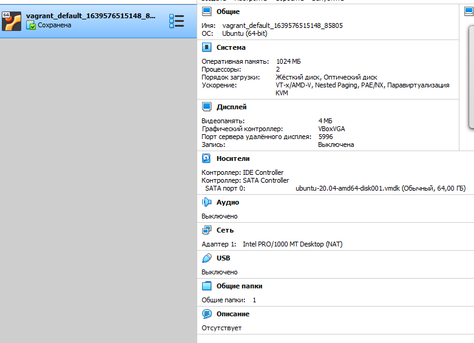

# Домашнее задание к занятию "3.1. Работа в терминале, лекция 1"

1. Установите средство виртуализации [Oracle VirtualBox](https://www.virtualbox.org/).

1. Установите средство автоматизации [Hashicorp Vagrant](https://www.vagrantup.com/).

1. В вашем основном окружении подготовьте удобный для дальнейшей работы терминал. Можно предложить:

	- использовал git bash

1. С помощью базового файла конфигурации запустите Ubuntu 20.04 в VirtualBox посредством Vagrant:

	* Создайте директорию, в которой будут храниться конфигурационные файлы Vagrant. В ней выполните `vagrant init`. Замените содержимое Vagrantfile по умолчанию следующим:

		```bash
		Vagrant.configure("2") do |config|
			config.vm.box = "bento/ubuntu-20.04"
		end
		```

	* Выполнение в этой директории `vagrant up` установит провайдер VirtualBox для Vagrant, скачает необходимый образ и запустит виртуальную машину.

	* `vagrant suspend` выключит виртуальную машину с сохранением ее состояния (т.е., при следующем `vagrant up` будут запущены все процессы внутри, которые работали на момент вызова suspend), `vagrant halt` выключит виртуальную машину штатным образом.

1. Ознакомьтесь с графическим интерфейсом VirtualBox, посмотрите как выглядит виртуальная машина, которую создал для вас Vagrant, какие аппаратные ресурсы ей выделены. Какие ресурсы выделены по-умолчанию? 


1. Ознакомьтесь с возможностями конфигурации VirtualBox через Vagrantfile: [документация](https://www.vagrantup.com/docs/providers/virtualbox/configuration.html). Как добавить оперативной памяти или ресурсов процессора виртуальной машине?

  ```
  Vagrant.configure("2") do |config|
  	config.vm.box = "bento/ubuntu-20.04"
	config.vm.provider "virtualbox" do |v|  	 
	 v.memory = 2048
	 v.cpus = 2
  end
  end
  ```
  

1. Команда `vagrant ssh` из директории, в которой содержится Vagrantfile, позволит вам оказаться внутри виртуальной машины без каких-либо дополнительных настроек. Попрактикуйтесь в выполнении обсуждаемых команд в терминале Ubuntu.

1. Ознакомиться с разделами `man bash`, почитать о настройках самого bash:
    * какой переменной можно задать длину журнала `history`, и на какой строчке manual это описывается?
		- HISTFILESIZE - 806 стр
    * что делает директива `ignoreboth` в bash?
		- отключает сохранение в истории команд терминала, начинающихся с проблема либо повторяющих предыдущую
	
1. В каких сценариях использования применимы скобки `{}` и на какой строчке `man bash` это описано?
стр. 249 для выполнения нескольких команд подряд, разделенных ; стр.1037 - механизм раскрытия скобок, для генерации строк
1. С учётом ответа на предыдущий вопрос, как создать однократным вызовом `touch` 100000 файлов? Получится ли аналогичным образом создать 300000? Если нет, то почему?
	- touch testfile{1..100000}
	- touch tf{1..300000}
		-bash: /usr/bin/touch: Argument list too long
1. В man bash поищите по `/\[\[`. Что делает конструкция `[[ -d /tmp ]]`
возвращает 0 или 1 в зависимости от результата команды в двойных квадратных скобках. -d проверяет директория ли /tmp
1. Основываясь на знаниях о просмотре текущих (например, PATH) и установке новых переменных; командах, которые мы рассматривали, добейтесь в выводе type -a bash в виртуальной машине наличия первым пунктом в списке:

	```bash
	bash is /tmp/new_path_directory/bash
	bash is /usr/local/bin/bash
	bash is /bin/bash
	```
	(прочие строки могут отличаться содержимым и порядком)
    В качестве ответа приведите команды, которые позволили вам добиться указанного вывода или соответствующие скриншоты.
	```bash
	vagrant@vagrant:~/test$ mkdir /tmp/new_path_directory
	vagrant@vagrant:~/test$ export PATH=/tmp/new_path_directory:$PATH
	vagrant@vagrant:~/test$ cp /bin/bash /tmp/new_path_directory/bash
	```
1. Чем отличается планирование команд с помощью `batch` и `at`?
	- at - исполнение команды в указанное время (поддерживаются разные форматы POSIX.2 )
	- batch - исполнение команды когда уровень нагрузки системы допустим, по умолчанию коэффицент 1.5, устанавливается atd -l/ При расчете нагрузки ядра складываются

1. Завершите работу виртуальной машины чтобы не расходовать ресурсы компьютера и/или батарею ноутбука.
```
vagrant halt
