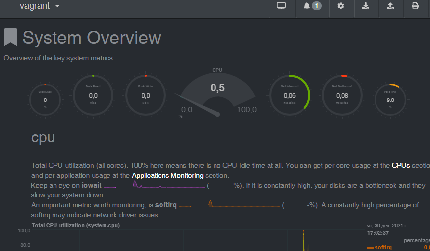
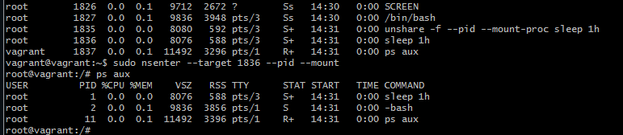

# Домашнее задание к занятию "3.4. Операционные системы, лекция 2"

1. На лекции мы познакомились с [node_exporter](https://github.com/prometheus/node_exporter/releases). В демонстрации его исполняемый файл запускался в background. Этого достаточно для демо, но не для настоящей production-системы, где процессы должны находиться под внешним управлением. Используя знания из лекции по systemd, создайте самостоятельно простой [unit-файл](https://www.freedesktop.org/software/systemd/man/systemd.service.html) для node_exporter:

    * поместите его в автозагрузку,
    * предусмотрите возможность добавления опций к запускаемому процессу через внешний файл (посмотрите, например, на `systemctl cat cron`),
    * удостоверьтесь, что с помощью systemctl процесс корректно стартует, завершается, а после перезагрузки автоматически поднимается.
```
 > tar xvf node_exporter-1.3.1.linux-amd64.tar.gz 
 > cp node_exporter /usr/sbin/
 > cat node_exporter.service
  [Unit]
  Description=node_exporter

  [Service]
  ExecStart=/usr/sbin/node_exporter node_exporter $NODEEXP_OPTS

  [Install]
  WantedBy=multi-user.target

> sudo cp node_exporter.service /lib/systemd/system/
> sudo systemctl enable node_exporter.service

Created symlink /etc/systemd/system/multi-user.target.wants/node_exporter.service → /lib/systemd/system/node_exporter.service
> systemctl start node_exporter.service
> systemctl status node_exporter.service
> systemctl stop node_exporter.service
> sudo reboot
> systemctl status node_exporter.service
● node_exporter.service - node_exporter
     Loaded: loaded (/lib/systemd/system/node_exporter.service; enabled; vendor preset: enabled)
     Active: active (running) since Thu 2021-12-30 07:47:41 UTC; 42s ago

```

1. Ознакомьтесь с опциями node_exporter и выводом `/metrics` по-умолчанию. Приведите несколько опций, которые вы бы выбрали для базового мониторинга хоста по CPU, памяти, диску и сети.

часть опций включена по умолчанию:
* по CPU:    --collector.cpu.guest --collector.cpu.info  --collector.perf   --collector.cpu    --collector.cpufreq    --collector.hwmon -- pressure -- loadavg 
* память:   --collector.meminfo   --collector.meminfo_numa   --collector.zoneinfo 
* диск: -- filesystem -- diskstats --bcache --filefd -- nfs --nfsd --nvme --devstat --boottime --mdadm --tapestats --mountstats --qdisc
* сеть: --arp --bonding --conntrack --ipvs --netclass --netdev --netstat --sockstat --udp_queues -network_route --tcpstat
2. Установите в свою виртуальную машину [Netdata](https://github.com/netdata/netdata). Воспользуйтесь [готовыми пакетами](https://packagecloud.io/netdata/netdata/install) для установки (`localhost:19999`). После успешной установки:
    * в конфигурационном файле `/etc/netdata/netdata.conf` в секции [web] замените значение с localhost на `bind to = 0.0.0.0`,
    * добавьте в Vagrantfile проброс порта Netdata на свой локальный компьютер и сделайте `vagrant reload`:

    ```bash
    config.vm.network "forwarded_port", guest: 19999, host: 19999
    ```

    После успешной перезагрузки в браузере *на своем ПК* (не в виртуальной машине) вы должны суметь зайти на `localhost:19999`. Ознакомьтесь с метриками, которые по умолчанию собираются Netdata и с комментариями, которые даны к этим метрикам.


3. Можно ли по выводу `dmesg` понять, осознает ли ОС, что загружена не на настоящем оборудовании, а на системе виртуализации?
> dmesg | grep -i .*hyper.*
[    0.000000] Hypervisor detected: KVM

4. Как настроен sysctl `fs.nr_open` на системе по-умолчанию? Узнайте, что означает этот параметр. Какой другой существующий лимит не позволит достичь такого числа (`ulimit --help`)?
> sysctl status fs.nr_open
sysctl: cannot stat /proc/sys/status: No such file or directory
 = 1048576
ситемное огранчиение на число файловых дескрипторов, 
$ ulimit -a
open files                      (-n) 1024 - мягкое ограничение
ulimit -aH
open files                      (-n) 1048576 - жесткое ограничение 
мягкое можно поднять до жесткого

5. Запустите любой долгоживущий процесс (не `ls`, который отработает мгновенно, а, например, `sleep 1h`) в отдельном неймспейсе процессов; покажите, что ваш процесс работает под PID 1 через `nsenter`. Для простоты работайте в данном задании под root (`sudo -i`). Под обычным пользователем требуются дополнительные опции (`--map-root-user`) и т.д.


6. Найдите информацию о том, что такое `:(){ :|:& };:`. Запустите эту команду в своей виртуальной машине Vagrant с Ubuntu 20.04 (**это важно, поведение в других ОС не проверялось**). Некоторое время все будет "плохо", после чего (минуты) – ОС должна стабилизироваться. Вызов `dmesg` расскажет, какой механизм помог автоматической стабилизации. Как настроен этот механизм по-умолчанию, и как изменить число процессов, которое можно создать в сессии?
```
[   11.772858] 14:01:48.636949 main     vbglR3GuestCtrlDetectPeekGetCancelSupport: Supported (#1)
[ 1986.451120] cgroup: fork rejected by pids controller in /user.slice/user-1000.slice/session-10.scope
vagrant@vagrant:~$ cat /sys/fs/cgroup/pids/user.slice/user-1000.slice/session-10.scope/pids.max
max
systemctl status user-1000.slice

● user-1000.slice - User Slice of UID 1000
     Loaded: loaded
    Drop-In: /usr/lib/systemd/system/user-.slice.d
             └─10-defaults.conf
     Active: active since Thu 2021-12-30 14:06:41 UTC; 48min ago
       Docs: man:user@.service(5)
      Tasks: 8 (limit: 5014)
     Memory: 35.0M
     CGroup: /user.slice/user-1000.slice
             ├─session-10.scope
``` 
> cat /usr/lib/systemd/system/user-.slice.d/10-defaults.conf
```
[Slice]
TasksMax=33%
```
- можно указать конкретное число процессов
 