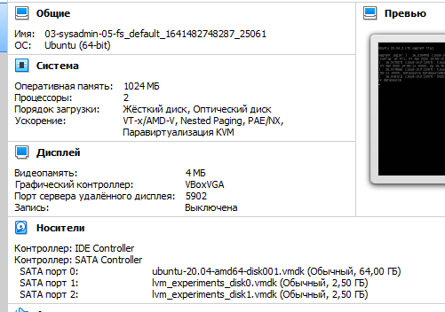
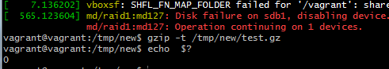

# Домашнее задание к занятию "3.5. Файловые системы"

1. Узнайте о [sparse](https://ru.wikipedia.org/wiki/%D0%A0%D0%B0%D0%B7%D1%80%D0%B5%D0%B6%D1%91%D0%BD%D0%BD%D1%8B%D0%B9_%D1%84%D0%B0%D0%B9%D0%BB) (разряженных) файлах.

     ```bash
    $ truncate -s1g ./sparse.test
    $ ls -l
       total 1048576
       -rw-r--r-- 1 lolyzar 197121 1073741824 Jan  6 17:45 sparse.test
       ## for Windows
	$ fsutil sparse queryflag sparse.test
      This file is NOT set as sparse
    $ fsutil sparse setflag sparse.test
    ```
1. Могут ли файлы, являющиеся жесткой ссылкой на один объект, иметь разные права доступа и владельца? Почему?
> нет, фактически права имеет объект соответсвующий уникальному inode, пожтму при изменеии прав для любой из hardlink права будут меняться у всех.

1. Сделайте `vagrant destroy` на имеющийся инстанс Ubuntu. Замените содержимое Vagrantfile следующим:

    ```bash
    Vagrant.configure("2") do |config|
      config.vm.box = "bento/ubuntu-20.04"
      config.vm.provider :virtualbox do |vb|
        lvm_experiments_disk0_path = "./lvm_experiments_disk0.vmdk"
        lvm_experiments_disk1_path = "./lvm_experiments_disk1.vmdk"
        vb.customize ['createmedium', '--filename', lvm_experiments_disk0_path, '--size', 2560]
        vb.customize ['createmedium', '--filename', lvm_experiments_disk1_path, '--size', 2560]
        vb.customize ['storageattach', :id, '--storagectl', 'SATA Controller', '--port', 1, '--device', 0, '--type', 'hdd', '--medium', lvm_experiments_disk0_path]
        vb.customize ['storageattach', :id, '--storagectl', 'SATA Controller', '--port', 2, '--device', 0, '--type', 'hdd', '--medium', lvm_experiments_disk1_path]
      end
    end
    ```
    Данная конфигурация создаст новую виртуальную машину с двумя дополнительными неразмеченными дисками по 2.5 Гб.
	
	

1. Используя `fdisk`, разбейте первый диск на 2 раздела: 2 Гб, оставшееся пространство.
```bash
$ lsblk
NAME                 MAJ:MIN RM  SIZE RO TYPE MOUNTPOINT
sda                    8:0    0   64G  0 disk
├─sda1                 8:1    0  512M  0 part /boot/efi
├─sda2                 8:2    0    1K  0 part
└─sda5                 8:5    0 63.5G  0 part
  ├─vgvagrant-root   253:0    0 62.6G  0 lvm  /
  └─vgvagrant-swap_1 253:1    0  980M  0 lvm  [SWAP]
sdb                    8:16   0  2.5G  0 disk
sdc                    8:32   0  2.5G  0 disk
$ sudo fdisk /dev/sdb
m - помощь
n - создание нового раздела
p - тип раздела (основной)
1 - номер
+2G - задание размера  от начального сектора (2048)
второй раздел аналогично, только вместо задания размера - <Enter>
w 
$ lsblk
sdb                    8:16   0  2.5G  0 disk
├─sdb1                 8:17   0    2G  0 part
└─sdb2                 8:18   0  511M  0 part
```
1. Используя `sfdisk`, перенесите данную таблицу разделов на второй диск.
``` bash
$ sudo sfdisk -d /dev/sdb | sudo sfdisk /dev/sdc
vagrant@vagrant:~$ lsblk /dev/sdb /dev/sdc
NAME   MAJ:MIN RM  SIZE RO TYPE MOUNTPOINT
sdb      8:16   0  2.5G  0 disk
├─sdb1   8:17   0    2G  0 part
└─sdb2   8:18   0  511M  0 part
sdc      8:32   0  2.5G  0 disk
├─sdc1   8:33   0    2G  0 part
└─sdc2   8:34   0  511M  0 part
```
1. Соберите `mdadm` RAID1 на паре разделов 2 Гб.
> vagrant@vagrant:~$ sudo mdadm --create --verbose /dev/md1 --level=1 --raid-devices=2 /dev/sdb1 /dev/sdc1
1. Соберите `mdadm` RAID0 на второй паре маленьких разделов.
> vagrant@vagrant:~$ sudo mdadm --create --verbose /dev/md0 --level=0 --raid-devices=2 /dev/sdb2 /dev/sdc2
1. Создайте 2 независимых PV на получившихся md-устройствах.
> vagrant@vagrant:~$ sudo pvcreate /dev/md0 /dev/md1
1. Создайте общую volume-group на этих двух PV.
> vagrant@vagrant:~$ sudo vgcreate vgkorsh /dev/md0 /dev/md1
1. Создайте LV размером 100 Мб, указав его расположение на PV с RAID0.
> $ sudo lvcreate --size 100m vgkorsh /dev/md0
1. Создайте `mkfs.ext4` ФС на получившемся LV.
>sudo  mkfs.ext4 /dev/vgkorsh/lvol0
1. Смонтируйте этот раздел в любую директорию, например, `/tmp/new`.
```
$lsblk  -o NAME,UUID
    └─vgkorsh-lvol0  8b7c4481-5b0e-4ef3-979d-c7a2f1f8c84b

$ sudo vim /etc/fstab
# <file system> <mount point>   <type>  <options>       <dump>  <pass>
...
/dev/vgkorsh/lvol0 /tmp/new     ext4
$ reboot
$ df 
/dev/mapper/vgkorsh-lvol0      95088      72     87848   1% /tmp/new

```

3. Поместите туда тестовый файл, например `wget https://mirror.yandex.ru/ubuntu/ls-lR.gz -O /tmp/new/test.gz`.
$ sudo wget https://mirror.yandex.ru/ubuntu/ls-lR.gz -O /tmp/new/test.gz
2022-01-10 11:32:21 (9.98 MB/s) - ‘/tmp/new/test.gz’ saved [21549953/21549953]

4. Прикрепите вывод `lsblk`.
```
vagrant@vagrant:/tmp/new$ lsblk
NAME                 MAJ:MIN RM  SIZE RO TYPE  MOUNTPOINT
sda                    8:0    0   64G  0 disk
├─sda1                 8:1    0  512M  0 part  /boot/efi
├─sda2                 8:2    0    1K  0 part
└─sda5                 8:5    0 63.5G  0 part
  ├─vgvagrant-root   253:0    0 62.6G  0 lvm   /
  └─vgvagrant-swap_1 253:1    0  980M  0 lvm   [SWAP]
sdb                    8:16   0  2.5G  0 disk
├─sdb1                 8:17   0    2G  0 part
│ └─md127              9:127  0    2G  0 raid1
└─sdb2                 8:18   0  511M  0 part
  └─md126              9:126  0 1018M  0 raid0
    └─vgkorsh-lvol0  253:2    0  100M  0 lvm   /tmp/new
sdc                    8:32   0  2.5G  0 disk
├─sdc1                 8:33   0    2G  0 part
│ └─md127              9:127  0    2G  0 raid1
└─sdc2                 8:34   0  511M  0 part
  └─md126              9:126  0 1018M  0 raid0
    └─vgkorsh-lvol0  253:2    0  100M  0 lvm   /tmp/new
```
6. Протестируйте целостность файла:
    ```bash
    root@vagrant:~# gzip -t /tmp/new/test.gz
    root@vagrant:~# echo $?
    0
    ```
> результат аналогичный 
7. Используя pvmove, переместите содержимое PV с RAID0 на RAID1.
> $ sudo pvmove /dev/md126 /dev/md127

8. Сделайте `--fail` на устройство в вашем RAID1 md.
>$ sudo mdadm --fail /dev/md127 /dev/sdb1

9. Подтвердите выводом `dmesg`, что RAID1 работает в деградированном состоянии.
```
$dmesg
[  565.123604] md/raid1:md127: Disk failure on sdb1, disabling device.
               md/raid1:md127: Operation continuing on 1 devices.
``` 
11. Протестируйте целостность файла, несмотря на "сбойный" диск он должен продолжать быть доступен:

     ```bash
     root@vagrant:~# gzip -t /tmp/new/test.gz
     root@vagrant:~# echo $?
     0
     ```
	
12. Погасите тестовый хост, `vagrant destroy`.

 
 ---

