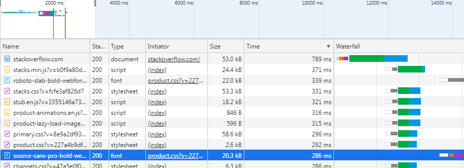
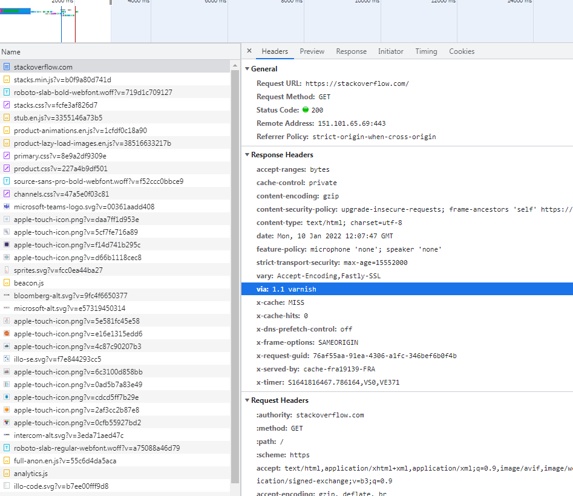
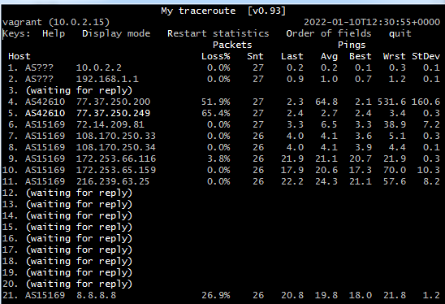
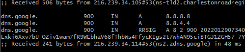
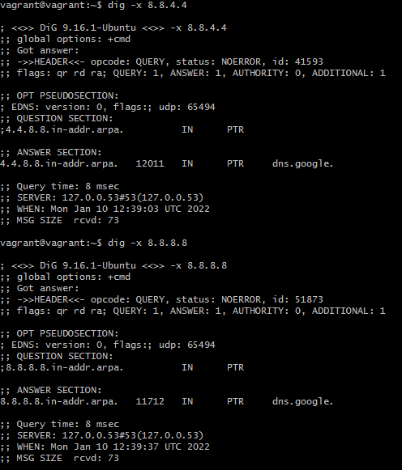

# Домашнее задание к занятию "3.6. Компьютерные сети, лекция 1"

1. Работа c HTTP через телнет.
- Подключитесь утилитой телнет к сайту stackoverflow.com
`telnet stackoverflow.com 80`
```
vagrant@vagrant:~$ telnet stackoverflow.com 80
Trying 151.101.65.69...
Connected to stackoverflow.com.
Escape character is '^]'.
```
- отправьте HTTP запрос
```bash
GET /questions HTTP/1.0
HOST: stackoverflow.com
[press enter]
[press enter]
```
- В ответе укажите полученный HTTP код, что он означает?
>HTTP/1.1 301 Moved Permanently
страница перемещена на другой адрес, новый адрес (только через https) в поле  location:  https://stackoverflow.com/questions
2. Повторите задание 1 в браузере, используя консоль разработчика F12.
- откройте вкладку `Network`
- отправьте запрос http://stackoverflow.com
- найдите первый ответ HTTP сервера, откройте вкладку `Headers`
- укажите в ответе полученный HTTP код.
> Status Code: 307 Internal Redirect
- проверьте время загрузки страницы, какой запрос обрабатывался дольше всего?
> Request URL: https://stackoverflow.com/
> Request Method: GET
- приложите скриншот консоли браузера в ответ.


4. Какой IP адрес у вас в интернете?

5. Какому провайдеру принадлежит ваш IP адрес? Какой автономной системе AS? Воспользуйтесь утилитой `whois`
```
$sudo apt install whois
$whois 87.240.55.154
organisation:   ORG-Ct3-RIPE
org-name:       "Central Telegraph" Public Joint-stock Company
...
route:          87.240.48.0/20
descr:          CNT block
origin:         AS42610
```
7. Через какие сети проходит пакет, отправленный с вашего компьютера на адрес 8.8.8.8? Через какие AS? Воспользуйтесь утилитой `traceroute`
```
#без  -I не работало
vagrant@vagrant:~$ traceroute -AIn 8.8.8.8
traceroute to 8.8.8.8 (8.8.8.8), 30 hops max, 60 byte packets
 1  10.0.2.2 [*]  0.538 ms  0.523 ms  0.509 ms
 2  192.168.1.1 [*]  2.597 ms  2.592 ms  2.588 ms
 3  * * *
 4  77.37.250.200 [AS42610]  3.370 ms  3.367 ms  3.363 ms
 5  77.37.250.249 [AS42610]  3.718 ms  3.713 ms  4.056 ms
 6  72.14.209.81 [AS15169]  7.610 ms  4.050 ms  4.655 ms
 7  108.170.250.33 [AS15169]  4.647 ms  5.731 ms  5.655 ms
 8  108.170.250.34 [AS15169]  4.776 ms  5.642 ms  5.638 ms
 9  172.253.66.116 [AS15169]  22.055 ms  22.479 ms  22.475 ms
10  172.253.65.159 [AS15169]  18.938 ms  19.603 ms  19.602 ms
11  216.239.63.25 [AS15169]  23.193 ms  23.806 ms  23.953 ms
12  * * *
13  * * *
14  * * *
15  * * *
16  * * *
17  * * *
18  * * *
19  * * *
20  * * *
21  * 8.8.8.8 [AS15169]  21.246 ms  19.539 ms
```
9. Повторите задание 5 в утилите `mtr`. На каком участке наибольшая задержка - delay?
если считать по среднему, то участок   9. AS15169  172.253.66.116  - 172.253.65.159 -   216.239.63.25 

10. Какие DNS сервера отвечают за доменное имя dns.google? Какие A записи? воспользуйтесь утилитой `dig`


11. Проверьте PTR записи для IP адресов из задания 7. Какое доменное имя привязано к IP? воспользуйтесь утилитой `dig`



dns.google. 

---

---

