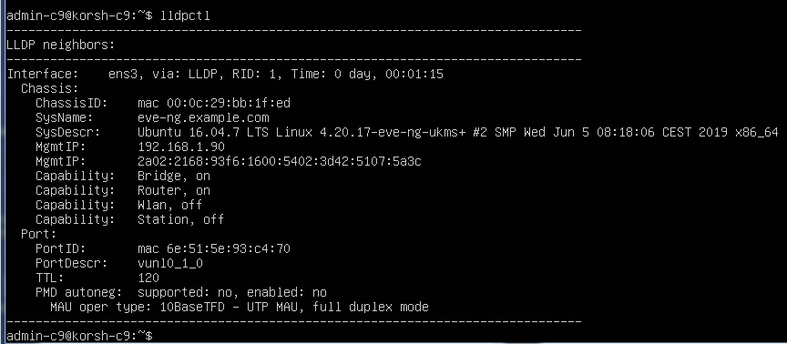
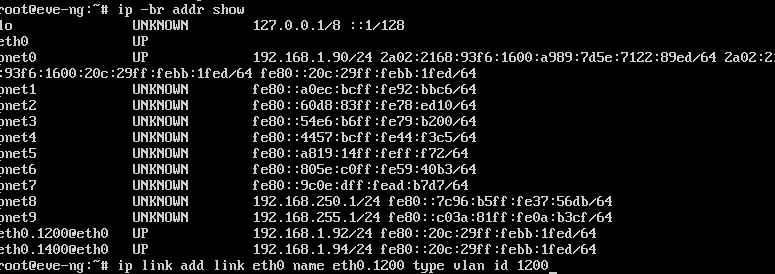
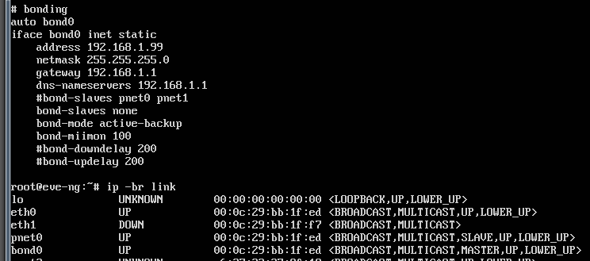

# Домашнее задание к занятию "3.7. Компьютерные сети, лекция 2"

1. Проверьте список доступных сетевых интерфейсов на вашем компьютере. Какие команды есть для этого в Linux и в Windows?
```
vagrant@netology1:~$ ip -br link
lo               UNKNOWN        00:00:00:00:00:00 <LOOPBACK,UP,LOWER_UP>
eth0             UP             08:00:27:73:60:cf <BROADCAST,MULTICAST,UP,LOWER_UP>
eth1             UP             08:00:27:e0:96:49 <BROADCAST,MULTICAST,UP,LOWER_UP>
```
   Для Windows - ipconfig

2. Какой протокол используется для распознавания соседа по сетевому интерфейсу? Какой пакет и команды есть в Linux для этого?
   - протокол LLDP
   - пакет lldpd, команда lldpctl  

3. Какая технология используется для разделения L2 коммутатора на несколько виртуальных сетей? Какой пакет и команды есть в Linux для этого? Приведите пример конфига.
   - технология VLAN, пакет vlan
   - правим файл /etc/network/interfaces
        auto eth0vlan.10
        iface eth0vlan.10 inet static
        address 192.168.1.100
        netmask 255.255.255.0
        vlan_raw_device eth0
   - auto eth0vlan.20
        iface eth0vlan.20 inet static
        address 192.168.1.101
        netmask 255.255.255.0
        vlan_raw_device eth0
   ...
   - в других дистрибутивах могут быть другие файлы

4. Какие типы агрегации интерфейсов есть в Linux? Какие опции есть для балансировки нагрузки? Приведите пример конфига.
   - типы LAG - статический (cisco mode on) и динамический (cisco mode active)
   -  в linux называется bonding, и предполагает создание нового сетевого интерфейса с кофигурацией на этапе запуска/перезагрузки интерфейса (ifdown/ifup)   
> modprobe bonding mode=balance-alb miimon=100 

основная опция mode и варианты:  balance-rr (перебор интерфейсов по кругу), active-backup (один постоянно активен, второй резерв), balance-xor (выборка по операции xor на адресами и взятии остатка по числу доступных интерфейсов), broadcast (отправка через все интерфейсы одновременно), 802.3ad (динамическое аггрегирование на основе данных по скорости и поддерживаемым режимам), balance-tlb (исходящий трафик распрделяется равномерно по все интерфейсамб входящий принимается текущим), balance-alb (включает tlb + балансировка входящего трафика)

6. Сколько IP адресов в сети с маской /29 ? Сколько /29 подсетей можно получить из сети с маской /24. Приведите несколько примеров /29 подсетей внутри сети 10.10.10.0/24.
> Hosts/Net: 6 + 1 broadcast + 1 адрес сети   
>  в сети/24  возможно 32 /29 подсетей
> 10.10.10.0/29 10.10.10.8/29 10.10.10.16/29 ... 10.10.10.248/29

7. Задача: вас попросили организовать стык между 2-мя организациями. Диапазоны 10.0.0.0/8, 172.16.0.0/12, 192.168.0.0/16 уже заняты. Из какой подсети допустимо взять частные IP адреса? Маску выберите из расчета максимум 40-50 хостов внутри подсети.
подсеть 100.64.0.0/10, для конкретной задачи (40-50 хостов) нужна подсеть /26  на 62 уникальных адреса например 100.100.100.192/26 	

8. Как проверить ARP таблицу в Linux, Windows? Как очистить ARP кеш полностью? Как из ARP таблицы удалить только один нужный IP?
> Win - arp -a , удаление узла - arp -d
> Linux - ip neigh delete

 ---
## Задание для самостоятельной отработки (необязательно к выполнению)

 8*. Установите эмулятор EVE-ng.
 
 Инструкция по установке - https://github.com/svmyasnikov/eve-ng

 Выполните задания на lldp, vlan, bonding в эмуляторе EVE-ng. 
 
   
 
 ---
