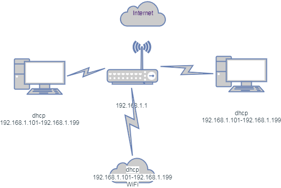

# Домашнее задание к занятию "3.8. Компьютерные сети, лекция 3"

1. Подключитесь к публичному маршрутизатору в интернет. Найдите маршрут к вашему публичному IP
```
telnet route-views.routeviews.org
Username: rviews
show ip route x.x.x.x/32
show bgp x.x.x.x/32
---
route-views>show ip route 87.240.55.154
Routing entry for 87.240.48.0/20
  Known via "bgp 6447", distance 20, metric 0
  Tag 852, type external
  Last update from 154.11.12.212 3w6d ago
  Routing Descriptor Blocks:
  * 154.11.12.212, from 154.11.12.212, 3w6d ago
      Route metric is 0, traffic share count is 1
      AS Hops 3
      Route tag 852
      MPLS label: none

route-views>show bgp 87.240.55.154
BGP routing table entry for 87.240.48.0/20, version 1418012170
Paths: (23 available, best #14, table default)
  Not advertised to any peer
  Refresh Epoch 3
  3303 1273 12389 42610
    217.192.89.50 from 217.192.89.50 (138.187.128.158)
      Origin IGP, localpref 100, valid, external
      Community: 1273:12276 1273:32090 3303:1004 3303:1006 3303:3056
      path 7FE03E7B7888 RPKI State not found
      rx pathid: 0, tx pathid: 0
  Refresh Epoch 1
```
2. Создайте dummy0 интерфейс в Ubuntu. Добавьте несколько статических маршрутов. Проверьте таблицу маршрутизации.
```
sudo echo "dummy" | sudo tee -a /etc/modules
sudo echo "options dummy numdummies=2" | sudo tee -a /etc/modprobe.d/dummy.conf
sudo vim /etc/network/interfaces
   auto dummy0
   iface dummy0 inet static
   address 10.2.2.2/24
   pre-up ip link add dummy0 type dummy
   post-down ip link del dummy0
   
   post-up ip route add 10.2.2.0/24 dev dummy0 src 10.2.2.2 table mgmt
   #через dummy не нужно default 
   #post-up ip route add default via 10.2.2.1 dev dummy0 table mgmt
   post-up ip rule add from 10.2.2.2/32 table mgmt
   post-up ip rule add to 10.2.2.2/32 table mgmt

ip -br link
   lo               UNKNOWN        00:00:00:00:00:00 <LOOPBACK,UP,LOWER_UP>
   eth0             UP             08:00:27:73:60:cf <BROADCAST,MULTICAST,UP,LOWER_UP>
   eth1             DOWN           08:00:27:e0:96:49 <BROADCAST,MULTICAST>
   dummy0           UNKNOWN        16:7f:84:59:51:71 <BROADCAST,NOARP,UP,LOWER_UP>
```
4. Проверьте открытые TCP порты в Ubuntu, какие протоколы и приложения используют эти порты? Приведите несколько примеров.
```
# можно использовать `ss -tna`
vagrant@vagrant:~$ sudo lsof -nP -i | grep TCP

   systemd     1            root   35u  IPv4  15574      0t0  TCP *:111 (LISTEN)
   systemd     1            root   37u  IPv6  15578      0t0  TCP *:111 (LISTEN)
   rpcbind   594            _rpc    4u  IPv4  15574      0t0  TCP *:111 (LISTEN)
   rpcbind   594            _rpc    6u  IPv6  15578      0t0  TCP *:111 (LISTEN)
   systemd-r 595 systemd-resolve   13u  IPv4  21889      0t0  TCP 127.0.0.53:53 (LISTEN)
   sshd      904            root    3u  IPv4  24554      0t0  TCP *:22 (LISTEN)
   sshd      904            root    4u  IPv6  24556      0t0  TCP *:22 (LISTEN)
   sshd      935            root    4u  IPv4  25756      0t0  TCP 10.0.2.15:22->10.0.2.2:55566 (ESTABLISHED)
   sshd      972         vagrant    4u  IPv4  25756      0t0  TCP 10.0.2.15:22->10.0.2.2:55566 (ESTABLISHED)
   telnet    1038         vagrant    3u  IPv4  26865      0t0  TCP 10.0.2.15:48396->128.223.51.103:23 (ESTABLISHED)
  ```
в примере ssh и telnet соединения

6. Проверьте используемые UDP сокеты в Ubuntu, какие протоколы и приложения используют эти порты?
```
vagrant@vagrant:~$ ss -ua
State                Recv-Q               Send-Q                              Local Address:Port                                Peer Address:Port               Process
UNCONN               0                    0                                   127.0.0.53%lo:domain                                   0.0.0.0:*
UNCONN               0                    0                                  10.0.2.15%eth0:bootpc                                   0.0.0.0:*
UNCONN               0                    0                                         0.0.0.0:sunrpc                                   0.0.0.0:*
UNCONN               0                    0                                            [::]:sunrpc                                      [::]:*
```
приложений активных нет,  можно добавить
```
nc -u -n 10.2.2.2 -l 2222  | nc -u -n 127.0.0.1 22   &
vagrant@vagrant:~$ ss -una
State                Recv-Q               Send-Q                              Local Address:Port                                Peer Address:Port               Process
UNCONN               0                    0                                   127.0.0.53%lo:53                                       0.0.0.0:*
UNCONN               0                    0                                  10.0.2.15%eth0:68                                       0.0.0.0:*
UNCONN               0                    0                                         0.0.0.0:111                                      0.0.0.0:*
UNCONN               0                    0                                        10.2.2.2:2222                                     0.0.0.0:*
UNCONN               0                    0                                        10.2.2.2:2222                                     0.0.0.0:*
ESTAB                0                    0                                       127.0.0.1:51460                                  127.0.0.1:22
ESTAB                0                    0                                       127.0.0.1:43986                                  127.0.0.1:22
UNCONN               0                    0                                            [::]:111                                         [::]:*
```
7. Используя diagrams.net, создайте L3 диаграмму вашей домашней сети или любой другой сети, с которой вы работали. 


 ---
## Задание для самостоятельной отработки (необязательно к выполнению)

6*. Установите Nginx, настройте в режиме балансировщика TCP или UDP.

  - пример конфигов, если повесить ip на этот же сервер, то nginx будет выдавать ошибку 500, поскольку он будет проксировать запросы на себя. То есть это должны быть другие сервера.
```bash
> sudo vi /etc/nginx/nginx.conf`
      http {
        upstream korshproject1 {
          server 172.30.1.5;
          server 172.30.1.6;
          server 172.30.1.7;
        }
      }
> sudo vim /etc/nginx/sites-enabled/default`
        server {
          listen 80;
          server_name korshproject.com;
          location / {
           proxy_pass http://korshproject1;
          }
        }
```
7*. Установите bird2, настройте динамический протокол маршрутизации RIP.

8*. Установите Netbox, создайте несколько IP префиксов, используя curl проверьте работу API.

 ---

