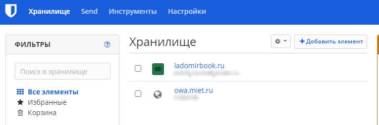
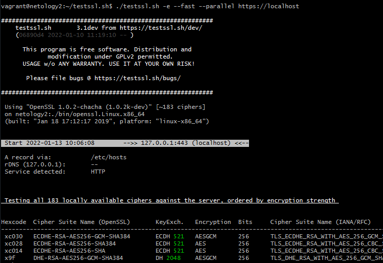

# Домашнее задание к занятию "3.9. Элементы безопасности информационных систем"

1. Установите Bitwarden плагин для браузера. Зарегестрируйтесь и сохраните несколько паролей.

2. Установите Google authenticator на мобильный телефон. Настройте вход в Bitwarden акаунт через Google authenticator OTP.

3. Установите apache2, сгенерируйте самоподписанный сертификат, настройте тестовый сайт для работы по HTTPS.
```bash
sudo apt install apache2
sudo openssl req -x509 -nodes -days 365 -newkey rsa:2048 \
-keyout /etc/ssl/private/apache-selfsigned.key \
-out /etc/ssl/certs/apache-selfsigned.crt \
-subj "/C=RU/ST=Moscow/L=Moscow/O=Company Name/OU=Org/CN=www.example.com"

sudo vim /etc/apache2/sites-available/korshdevops.conf
<VirtualHost *:443>
ServerName korshdevops
DocumentRoot /var/www/korshdevops
SSLEngine on
SSLCertificateFile /etc/ssl/certs/apache-selfsigned.crt
SSLCertificateKeyFile /etc/ssl/private/apache-selfsigned.key
</VirtualHost>
sudo mkdir /var/www/korshdevops
sudo vim /var/www/korshdevops/index.html
<h1>it worked!</h1>

sudo a2ensite korshdevops.conf
sudo apache2ctl configtest
sudo systemctl reload apache2

echo "127.0.0.1     korshdevops" | sudo tee -a /etc/hosts

w3m https://korshdevops/index.html
```


4. Проверьте на TLS уязвимости произвольный сайт в интернете.



5. Установите на Ubuntu ssh сервер, сгенерируйте новый приватный ключ. Скопируйте свой публичный ключ на другой сервер. Подключитесь к серверу по SSH-ключу.
> подключился внутри другой ssh сессии 

8. Переименуйте файлы ключей из задания 5. Настройте файл конфигурации SSH клиента, так чтобы вход на удаленный сервер осуществлялся по имени сервера.


10. Соберите дамп трафика утилитой tcpdump в формате pcap, 100 пакетов. Откройте файл pcap в Wireshark.

 ---
## Задание для самостоятельной отработки (необязательно к выполнению)

8*. Просканируйте хост scanme.nmap.org. Какие сервисы запущены?
 sudo nmap -sV scanme.nmap.org


9*. Установите и настройте фаервол ufw на web-сервер из задания 3. Откройте доступ снаружи только к портам 22,80,443
```
$ sudo ufw default deny incoming
$ sudo ufw allow 22
$ sudo ufw allow 80
$ sudo ufw allow 443
$ sudo ufw enable
```
---

