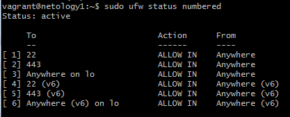
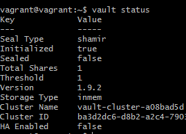
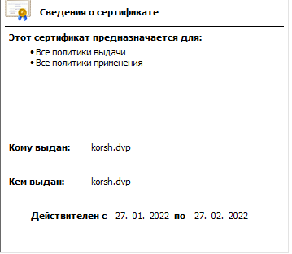
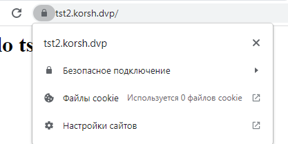
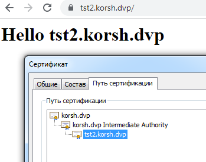
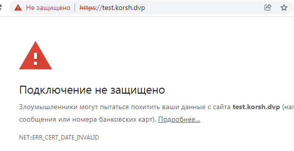
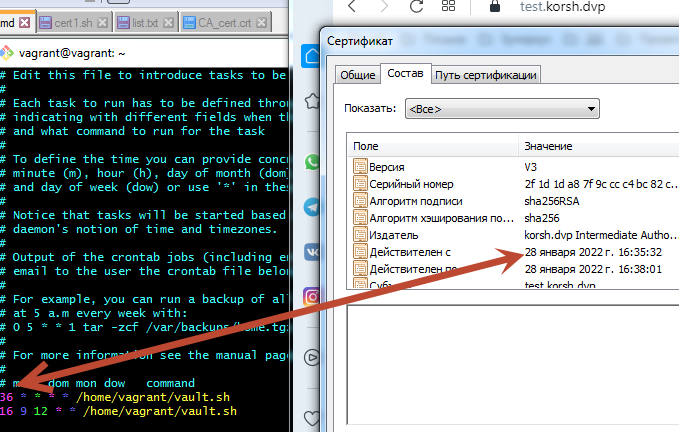
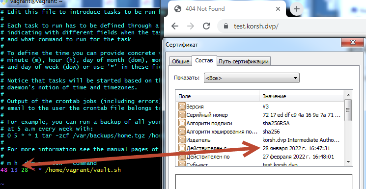

# Курсовая работа по итогам модуля "DevOps и системное администрирование"

Курсовая работа необходима для проверки практических навыков, полученных в ходе прохождения курса "DevOps и системное администрирование".

Мы создадим и настроим виртуальное рабочее место. Позже вы сможете использовать эту систему для выполнения домашних заданий по курсу

## Задание

1. Создайте виртуальную машину Linux.
```ruby
Vagrant.configure("2") do |config|
  #фиксированный ip для доступа с хоста
  config.vm.network "private_network", ip: "172.30.1.5"
  config.vm.box = "bento/ubuntu-20.04"
  config.vm.box_check_update = true
```
 
2. Установите ufw и разрешите к этой машине сессии на порты 22 и 443, при этом трафик на интерфейсе localhost (lo) должен ходить свободно на все порты.
```bash
sudo apt-get install -y ufw
sudo ufw allow 443
sudo ufw allow 22
sudo ufw allow in on lo to any
sudo ufw enable
sudo ufw status numbered
```


3. Установите hashicorp vault ([инструкция по ссылке](https://learn.hashicorp.com/tutorials/vault/getting-started-install?in=vault/getting-started#install-vault)).
```
curl -fsSL https://apt.releases.hashicorp.com/gpg | sudo apt-key add -
sudo apt-add-repository "deb [arch=amd64] https://apt.releases.hashicorp.com $(lsb_release -cs) main"
sudo apt-get update && sudo apt-get install vault
```


4. Cоздайте центр сертификации по инструкции ([ссылка] (https://learn.hashicorp.com/tutorials/vault/pki-engine?in=vault/secrets-management)) и выпустите сертификат для использования его в настройке веб-сервера nginx (срок жизни сертификата - месяц).
```bash
# в отдельной сессии
sudo vault server -dev -dev-root-token-id root
# в основной
export VAULT_ADDR=http://127.0.0.1:8200
export VAULT_TOKEN=root
vault secrets enable -max-lease-ttl=87600h pki
vault secrets tune -max-lease-ttl=87600h pki
#корневой
vault write -field=certificate pki/root/generate/internal common_name="korsh.dvp" ttl=87600h > CA_cert.crt
vault write pki/config/urls      issuing_certificates="$VAULT_ADDR/v1/pki/ca"      crl_distribution_points="$VAULT_ADDR/v1/pki/crl"
#промежуточный
vault secrets enable -path=pki_int pki
vault secrets tune -max-lease-ttl=87600h pki_int
vault write -format=json pki_int/intermediate/generate/internal   common_name="korsh.dvp Intermediate Authority"   | jq -r '.data.csr' > pki_intermediate.csr
vault write -format=json pki/root/sign-intermediate csr=@pki_intermediate.csr   format=pem_bundle ttl="87600h"      | jq -r '.data.certificate' > intermediate.cert.pem
vault write pki_int/intermediate/set-signed certificate=@intermediate.cert.pem
#определение роли для сертификатов
vault write pki_int/roles/korsh-dot-dvp    allowed_domains="korsh.dvp"      allow_subdomains=true      max_ttl="87600h"
#!!!!!! отличия от инструкции обязательно аргумент -json и время меньше чем промежуточный, выгрузка в файл
vault write -format=json pki_int/issue/korsh-dot-dvp    common_name="test.korsh.dvp" ttl="720h"  > test.korsh.dvp.crt
# создание двух файлов для nginx - 1 сертификат домена + промежуточный, 2  - ключ
sudo mkdir -p /opt/certs
cat test.korsh.dvp.crt | jq -r .data.certificate | sudo tee /opt/certs/test.korsh.dvp.crt.pem
cat test.korsh.dvp.crt | jq -r .data.issuing_ca  | sudo tee -a /opt/certs/test.korsh.dvp.crt.pem
cat test.korsh.dvp.crt | jq -r .data.private_key | sudo tee /opt/certs/test.korsh.dvp.crt.key	

```
5. Установите корневой сертификат созданного центра сертификации в доверенные в хостовой системе.

6. Установите nginx.
``` bash
sudo apt install nginx
nginx
```
7. По инструкции ([ссылка](https://nginx.org/en/docs/http/configuring_https_servers.html) ) настройте nginx на https, используя ранее подготовленный сертификат:
- можно использовать стандартную стартовую страницу nginx для демонстрации работы сервера;
- можно использовать и другой html файл, сделанный вами;
```bash 
cd /etc/nginx/sites-enabled
 sudo vi default
### deafault
server {
         listen 443 ssl default_server;
         listen [::]:443 ssl default_server;
         ssl_certificate /opt/certs/test.korsh.dvp.crt.pem;
         ssl_certificate_key /opt/certs/test.korsh.dvp.crt.key;
  server_name tst2.korsh.dvp;

        location / {
                  root /var/www/html/tst2_korsh;
                try_files $uri $uri/ =404;
        }
```
8. Откройте в браузере на хосте https адрес страницы, которую обслуживает сервер nginx.
     - прописал в hosts на локальной ip из настроек vagrant
	  
	 
9. Создайте скрипт, который будет генерировать новый сертификат в vault:
- генерируем новый сертификат так, чтобы не переписывать конфиг nginx;
- перезапускаем nginx для применения нового сертификата.

    * предполагаем, что vault не останавливается, поскльку в -dev режиме ничего не сохраняется в постоянную

```bash vault.sh
#!/bin/bash
#просто export в скрипте не сохранял перменную для следующих команд, поэтому отдельный скрипт
source /home/vagrant/vault_source.sh
#тестовое с двух минутным сертификатом для отладки
#vault write -format=json pki_int/issue/korsh-dot-dvp    common_name="test.korsh.dvp" ttl="2m"  | tee /home/vagrant/test.korsh.dvp.crt
vault write -format=json pki_int/issue/korsh-dot-dvp    common_name="test.korsh.dvp" ttl="720h"  | tee /home/vagrant/test.korsh.dvp.crt
cat /home/vagrant/test.korsh.dvp.crt | jq -r .data.certificate  | tee /opt/certs/test.korsh.dvp.crt.pem
cat /home/vagrant/test.korsh.dvp.crt | jq -r .data.issuing_ca   | tee -a /opt/certs/test.korsh.dvp.crt.pem
cat /home/vagrant/test.korsh.dvp.crt | jq -r .data.private_key  | tee /opt/certs/test.korsh.dvp.crt.key
sudo nginx -s reload
#### vault_source.sh нужна переменная для нормальной работы скрипта
export VAULT_ADDR=http://127.0.0.1:8200
export VAULT_TOKEN=root
```   
   далее `chmod +x vault.sh`
   иллюстрация просроченного двухминутного


10. Поместите скрипт в crontab, чтобы сертификат обновлялся какого-то числа каждого месяца в удобное для вас время.
    
   - нужны права, чтобы обновлять конфигурацию nginx
   `sudo crontab -e`
   сделал два правила одно для отладки - с выставлением конректной минуты часа,  и второе ежемесячное (12 число, в 09:16)
   иллюстрация запуска скрипта cron-ом

    иллюстрация месячного сертификата (подогнал под момент работы)
	
	
## Результат

Результатом курсовой работы должны быть снимки экрана или текст:

- Процесс установки и настройки ufw
- Процесс установки и выпуска сертификата с помощью hashicorp vault
- Процесс установки и настройки сервера nginx
- Страница сервера nginx в браузере хоста не содержит предупреждений
- Скрипт генерации нового сертификата работает (сертификат сервера ngnix должен быть "зеленым")
- Crontab работает (выберите число и время так, чтобы показать что crontab запускается и делает что надо)
